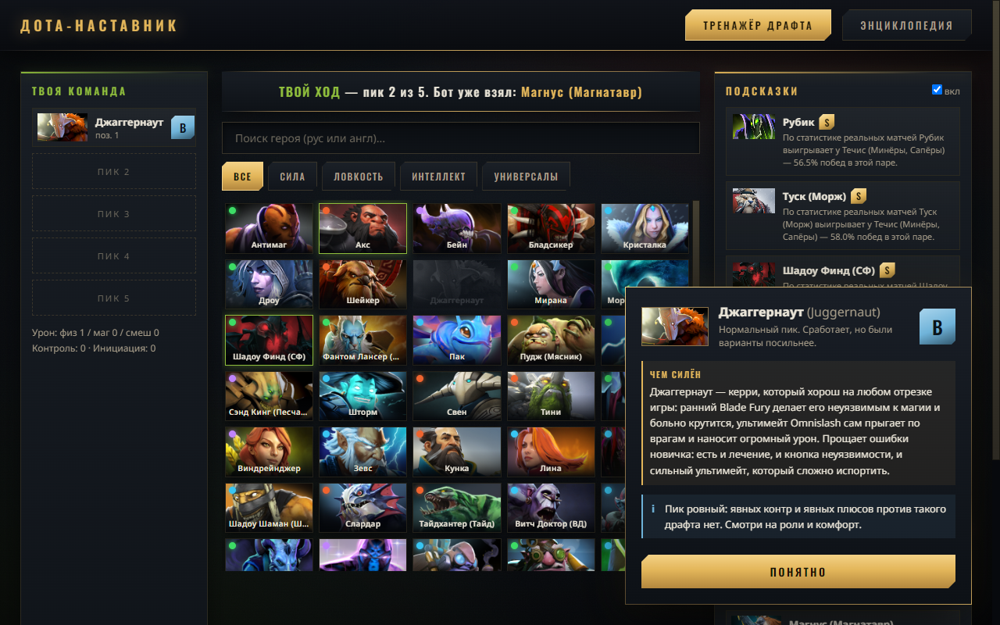
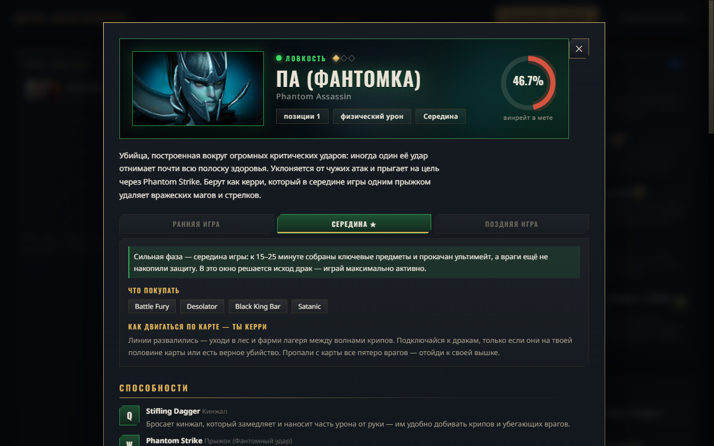
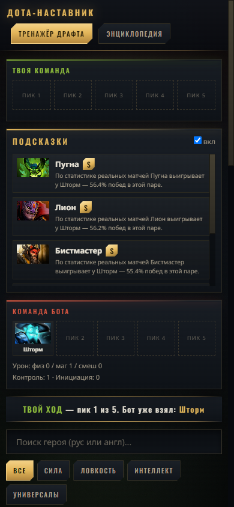

# Дота-Наставник

Тренажёр драфта и энциклопедия Dota 2 для новичков. Объясняет простым языком, почему один пик — хороший, а другой — подарок врагу.

## ▶ [Открыть приложение](https://l3ansh1e.github.io/dota-nastavnik/)

Работает прямо в браузере — на компьютере и на телефоне.

### Как поставить на iPhone

1. Открой [ссылку](https://l3ansh1e.github.io/dota-nastavnik/) в Safari.
2. Нажми «Поделиться» → **«На экран “Домой”»**.
3. На рабочем столе появится иконка — приложение открывается на весь экран.

### Версия для Windows

Не хочешь зависеть от браузера — есть обычная программа: **[скачать установщик](https://github.com/l3ansh1e/dota-nastavnik/releases/latest)** (77 МБ). Ставится в один клик, без прав администратора. При первом запуске Windows может показать предупреждение SmartScreen — нажми «Подробнее» → «Выполнить в любом случае».

## Что внутри

- **Тренажёр драфта** — мини-игра против бота: собери команду из пяти героев, после каждого пика получи оценку (S/A/B/C/D) и разбор: контры, синергии, баланс ролей и урона.
- **Сравнение способностей** — оценка объясняет, какая способность выключает какую: немота против заклинателей, уклонение против бойцов с автоатаками, иллюзии против точечного контроля.
- **Разбор после драфта** — где свернул не туда и кто на том же ходу был бы сильнее.
- **Энциклопедия 127 героев** — способности, сборки предметов, прокачка, кто кого контрит и почему, советы новичку.
- **План на игру** — у каждого героя по фазам: почему его сильная фаза именно эта, что покупать и как двигаться по карте.

## Скриншоты

| Тренажёр драфта | Карточка героя |
|---|---|
|  |  |

## На чём работает

- Чистые HTML / CSS / JS — без сборки и серверной части.
- Статистика пар героев — реальные матчи [OpenDota](https://www.opendota.com/), данные героев — [dotaconstants](https://github.com/odota/dotaconstants).
- Десктоп-версия для Windows — Electron, установщик в [Releases](https://github.com/l3ansh1e/dota-nastavnik/releases).
